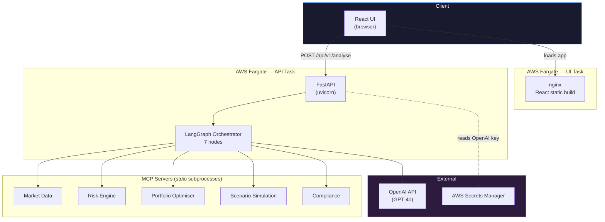
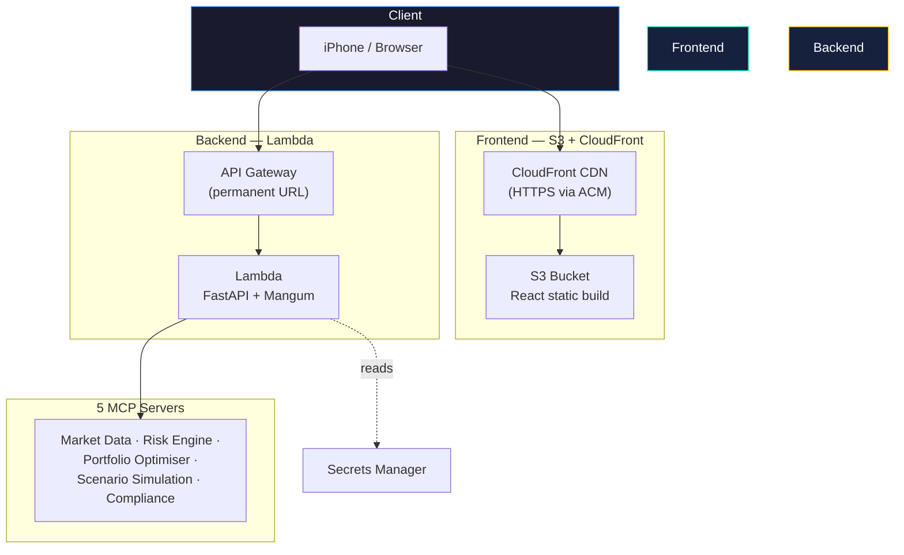

# Architecture

This document describes Portfolio Copilot's system design: how a request flows through the system, why it's built as five independent MCP servers rather than one backend, and how v1 (current, AWS Fargate) differs from the planned v2 (serverless).

---

## System overview (v1 — current)

Each MCP server is spawned as a genuine subprocess via `sys.executable`, communicating with the orchestrator over stdio using the [Model Context Protocol](https://modelcontextprotocol.io/). This is a deliberate choice: it keeps each domain of financial logic — data, risk, optimisation, simulation, compliance — independently testable and independently swappable, rather than a set of local function calls dressed up as "agents."

---

## Request lifecycle

1. **Client** submits a portfolio (symbols + weights) and a natural-language query to `POST /api/v1/analyse`
2. **FastAPI** validates the request against Pydantic schemas and hands off to the LangGraph orchestrator
3. **LangGraph** runs a fixed 7-node pipeline:

| Node | Calls | Purpose |
|---|---|---|
| `parse_query` | OpenAI | Classify the analysis type requested from the natural-language query |
| `fetch_market_data` | Market Data MCP server | Retrieve historical prices for held symbols |
| `compute_risk` | Risk Engine MCP server | Volatility, Sharpe, VaR/CVaR, drawdown, GARCH(1,1)-t forecast |
| `optimise` | Portfolio Optimiser MCP server | SLSQP mean-variance optimisation, efficient frontier |
| `simulate` | Scenario Simulation MCP server | Monte Carlo + GARCH-based 1-year forward paths |
| `check_compliance` | Compliance MCP server | Evaluate portfolio against a configurable YAML ruleset |
| `synthesise` | OpenAI | Combine all outputs into one coherent recommendation |

4. Each node's output accumulates into shared LangGraph state, visible to later nodes and returned in full to the client (including a step-by-step execution trace)
5. **React UI** renders the aggregated result across 7 tabs, each independently able to render before or without the others (empty states shown until data arrives)

---

## Why five separate MCP servers, not one backend module

- **Independent testability** — each server has its own test suite and its own `requirements.txt`, deliberately self-contained (no shared base dependency file)
- **Independent failure isolation** — a bug in the Scenario Simulation server's Monte Carlo logic can't corrupt the Compliance server's rule evaluation; they're separate processes
- **Genuine multi-agent demonstration** — this is the actual differentiator: it would be materially simpler to write this as one Python module with five functions. Building it as five real MCP servers demonstrates the protocol and the orchestration pattern, not just the financial logic
- **Swap-ready for v3** — when the Compliance server needs to evaluate proposed (not just held) tickers, or the Market Data server needs to move from CSV fixtures to live data, each change is contained to one server's codebase

---

## Deployment architecture (v1)

- **AWS ECS Fargate**, region `ap-south-1`, two separate services (API, UI), each `0.5 vCPU / 1GB`
- Images built for `linux/amd64` (required — Fargate in this region doesn't support ARM64/Graviton) and pushed to **ECR**
- OpenAI API key stored in **AWS Secrets Manager**, injected into the API container as an environment variable at task startup
- **CloudWatch Logs** for both services
- No Application Load Balancer — direct Fargate public IPs, a deliberate cost trade-off (see `Portfolio_Copilot_Reference.docx` for the full reasoning and cost comparison)
- IAM: a dedicated `ecsTaskExecutionRole` scoped to ECR pull, Secrets Manager read, and CloudWatch log write

**Known limitation:** Fargate assigns each service a new public IP on every restart. The React build has the API's IP baked in at build time, so an API restart requires rebuilding and redeploying the UI with the updated IP. v2 removes this entirely.

---

## Planned architecture (v2 — serverless)

**What changes:**
- ECS/Fargate/Docker for the UI is replaced entirely by S3 + CloudFront (static hosting, HTTPS via a free ACM certificate)
- The API container is replaced by a Lambda function (FastAPI wrapped via the **Mangum** adapter), fronted by API Gateway for a permanent URL
- No more start/stop control plane — Lambda scales to zero natively, so there's no "running" state to toggle
- Open design question to resolve during the v2 build: whether the 5 MCP servers remain subprocess-spawned inside the Lambda execution environment, or get refactored into direct in-process function calls

**Target cost:** ~$0.31–0.35/month at typical demo-driven usage, versus $0.75–4/month for v1 depending on hours run.

---

## Tech stack

| Layer | Technology |
|---|---|
| Frontend | React, Plotly.js, Axios |
| Backend API | FastAPI, Uvicorn |
| Orchestration | LangGraph |
| Agent protocol | Model Context Protocol (MCP), stdio transport |
| LLM | OpenAI GPT-4o |
| Risk modelling | `arch` (GARCH), `scipy`, `numpy`, `pandas` |
| Optimisation | `scipy` (SLSQP solver; v3 moves to Differential Evolution) |
| Market data | `yfinance` (CSV fixtures in v1; live in v2/v3) |
| v1 deployment | AWS ECS Fargate, ECR, Secrets Manager, CloudWatch |
| v2 deployment (planned) | AWS Lambda, API Gateway, S3, CloudFront |
