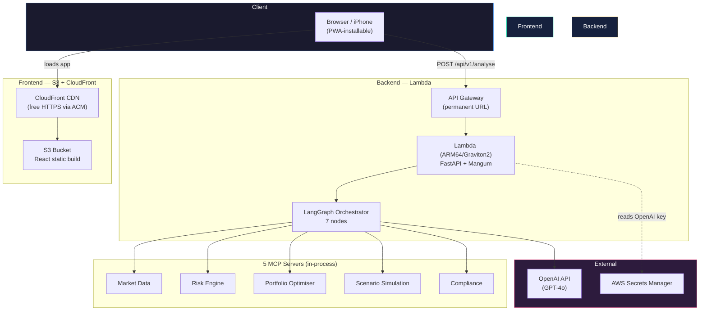
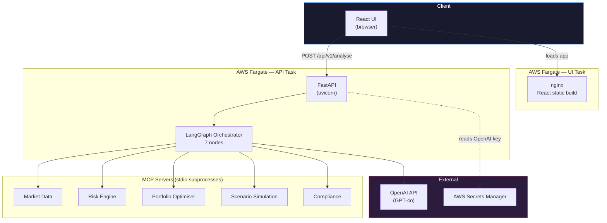

# Architecture

This document describes Portfolio Copilot's system design: how a request flows through the system, why it's built as five independent MCP servers rather than one backend, and how the current deployment (v2, serverless) differs from the previous one (v1, ECS Fargate) — which is kept in the repo alongside v2 rather than removed.

---

## System overview (v2 — current, serverless)

**Live:** frontend at `https://d2jlcue9iriq3l.cloudfront.net`, backend at `https://701eexyejj.execute-api.ap-south-1.amazonaws.com`. Both URLs are permanent — they don't change across redeployments.

The biggest structural change from v1: all 5 MCP servers are now called as **direct in-process function calls** rather than spawned as stdio subprocesses. This was a deliberate trade — Lambda's execution environment makes subprocess-per-request expensive at cold start, so process isolation between servers was given up in exchange for materially lower latency. Each server's code is still organised as a self-contained module (own logic, own tests); only the invocation mechanism changed, not the domain separation.

---

## Request lifecycle

1. **Client** submits a portfolio (symbols + weights) and a natural-language query to `POST /api/v1/analyse` on API Gateway
2. **API Gateway** forwards the request to the Lambda function, which wraps FastAPI via Mangum
3. **FastAPI** validates the request against Pydantic schemas and hands off to the LangGraph orchestrator, running in the same Lambda invocation
4. **LangGraph** runs a fixed 7-node pipeline, now calling each MCP server's logic directly rather than over a stdio pipe:

| Node | Calls | Purpose |
|---|---|---|
| `parse_query` | OpenAI | Classify the analysis type requested from the natural-language query |
| `fetch_market_data` | Market Data (in-process) | Retrieve historical prices for held symbols |
| `compute_risk` | Risk Engine (in-process) | Volatility, Sharpe, VaR/CVaR, drawdown, GARCH(1,1)-t forecast |
| `optimise` | Portfolio Optimiser (in-process) | SLSQP mean-variance optimisation, efficient frontier |
| `simulate` | Scenario Simulation (in-process) | Monte Carlo + GARCH-based 1-year forward paths |
| `check_compliance` | Compliance (in-process) | Evaluate portfolio against a configurable YAML ruleset |
| `synthesise` | OpenAI | Combine all outputs into one coherent recommendation |

5. Each node's output accumulates into shared LangGraph state, visible to later nodes and returned in full to the client (including a step-by-step execution trace)
6. **React UI**, served from CloudFront, renders the aggregated result across 7 tabs, each independently able to render before or without the others (empty states shown until data arrives)

---

## Why five separate MCP servers, not one backend module

- **Independent testability** — each server has its own test suite and its own `requirements.txt`, deliberately self-contained (no shared base dependency file)
- **Independent domain separation** — a bug in the Scenario Simulation server's Monte Carlo logic is scoped to one module, not spread across the codebase; this held even after the v2 move to in-process calls, since the separation is organisational, not just process-level
- **Genuine multi-agent demonstration** — this is the actual differentiator: it would be materially simpler to write this as one Python module with five functions. Building it as five real MCP servers demonstrates the protocol and the orchestration pattern, not just the financial logic
- **Swap-ready for v3** — when the Compliance server needs to evaluate proposed (not just held) tickers, or the Market Data server needs to move from CSV fixtures to live data, each change is contained to one server's codebase

---

## Deployment architecture (v2 — current)

- **Backend:** AWS Lambda, container image, **ARM64/Graviton2**, 1024MB memory, 120s timeout, region `ap-south-1`, fronted by API Gateway (HTTP API) for a stable permanent URL
- **Frontend:** S3 static hosting (bucket `portfolio-copilot-frontend-442421142920`) behind a CloudFront distribution, using the S3 *website* endpoint (not the REST API endpoint) as origin — required for correct SPA routing on refresh/direct navigation. `ViewerProtocolPolicy` set to `redirect-to-https`.
- **MCP invocation:** all 5 servers refactored from subprocess-spawned to direct in-process function calls (see rationale above)
- **Secrets:** OpenAI API key in Secrets Manager, set as a Lambda environment variable at configuration time
- **PWA:** manifest, custom icon set, and iOS-specific meta tags added — installable via "Add to Home Screen" (iPhone) and "Add to Dock" (macOS)
- **No control plane** — Lambda scales to zero natively; there's no "running/stopped" state to manage, unlike v1's Fargate services

**Real issues hit building this** (full detail in `infra/LAMBDA_DEPLOYMENT.md` and `infra/FRONTEND_DEPLOYMENT.md`):

1. **Docker's attestation manifest breaks Lambda deploys** — buildx's default output includes an attestation/SBOM manifest that Lambda's container image support rejects (`InvalidParameterValueException: image manifest ... is not supported`). Fixed by building with `--provenance=false --sbom=false`.
2. **`logging.basicConfig()` is a silent no-op on Lambda** — the runtime pre-configures the root logger before application code runs. Every `logger.info()` in the orchestrator was invisible in CloudWatch until `force=True` was added — this was the precondition for diagnosing the next issue.
3. **The GARCH scenario simulation node, not Lambda resource limits, was the real performance bottleneck** — ~30s/call, ~60s for a full pipeline run. Doubling Lambda memory (and its proportional vCPU increase) made no difference, ruling out compute availability and confirming a single-threaded, unvectorised 10,000-simulation × 252-day for-loop as the cause. Pragmatic fix: reduced simulation count to 1,000 (pipeline now ~17–26s). A proper numpy-vectorised rewrite is deliberately deferred to v3 — this was infra-hardening scope, not modeling scope.
4. **iOS Safari enforces HTTPS more strictly than desktop browsers** — the plain-HTTP S3 website endpoint worked on desktop Chrome/Safari but failed on iPhone Safari. This made CloudFront's free HTTPS a genuine functional requirement for the working-iPhone-demo goal, not a nice-to-have.

**Cost:** targeting ~$0.31–0.35/month at typical demo-driven usage (versus v1's $0.75–4/month depending on hours run) — a real-usage check-in is still pending.

---

## Previous version (v1 — AWS ECS Fargate)

Kept in the repo (Dockerfiles, ECS task definitions, `api/routes/aws.py`) and permanently recoverable via `git checkout v1-fargate`, rather than deleted — the goal is to show both deployment approaches, since knowing when to use a container-orchestration platform versus a fully serverless one is itself part of the architectural story.

- **AWS ECS Fargate**, region `ap-south-1`, two separate services (API, UI), each `0.5 vCPU / 1GB`
- Images built for `linux/amd64` (required — Fargate in this region doesn't support ARM64/Graviton) and pushed to **ECR**
- OpenAI API key stored in **AWS Secrets Manager**, injected into the API container as an environment variable at task startup
- **CloudWatch Logs** for both services
- No Application Load Balancer — direct Fargate public IPs, a deliberate cost trade-off (see `Portfolio_Copilot_Reference.docx` for the full reasoning and cost comparison)
- IAM: a dedicated `ecsTaskExecutionRole` scoped to ECR pull, Secrets Manager read, and CloudWatch log write
- MCP servers spawned as genuine stdio subprocesses via `sys.executable` — full process isolation between servers, at the cost of subprocess-spawn latency (acceptable for a long-lived Fargate service, not for a Lambda cold start)

**Known limitation (resolved in v2):** Fargate assigned each service a new public IP on every restart. The React build had the API's IP baked in at build time, so an API restart required rebuilding and redeploying the UI with the updated IP.

---

## Tech stack

| Layer | Technology |
|---|---|
| Frontend | React, Plotly.js, Axios, PWA (manifest + iOS meta tags) |
| Backend API | FastAPI, Mangum (Lambda adapter) |
| Orchestration | LangGraph |
| Agent protocol | Model Context Protocol (MCP) — in-process calls (v2), stdio transport (v1) |
| LLM | OpenAI GPT-4o |
| Risk modelling | `arch` (GARCH), `scipy`, `numpy`, `pandas` |
| Optimisation | `scipy` (SLSQP solver; v3 moves to Differential Evolution) |
| Market data | `yfinance` (CSV fixtures in v1/v2; live in v3) |
| v2 deployment (current) | AWS Lambda (ARM64/Graviton2), API Gateway, S3, CloudFront |
| v1 deployment (previous) | AWS ECS Fargate, ECR, Secrets Manager, CloudWatch |