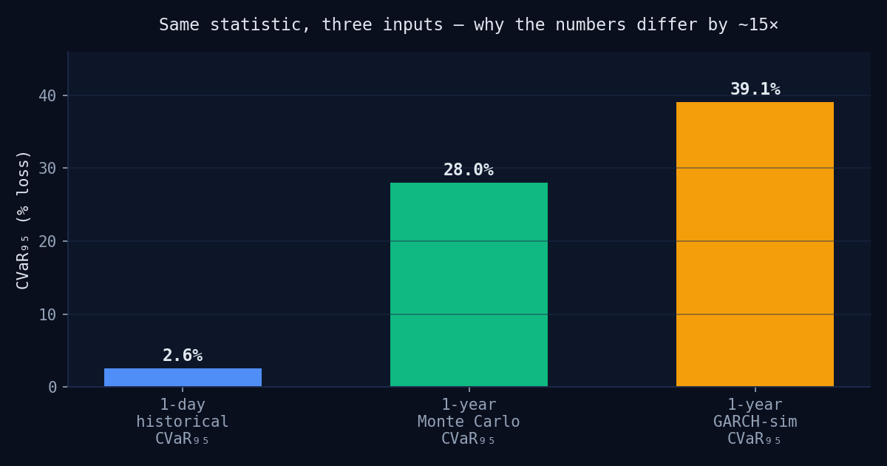
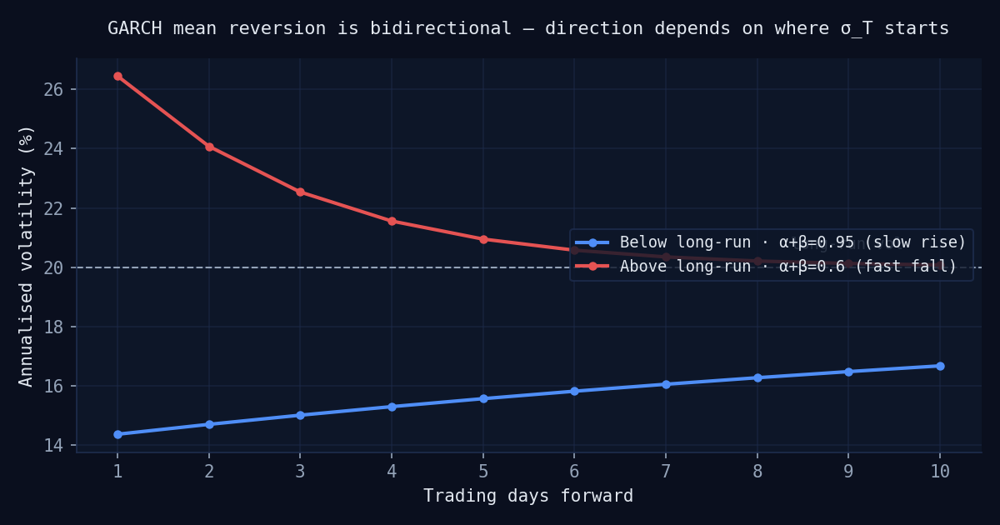
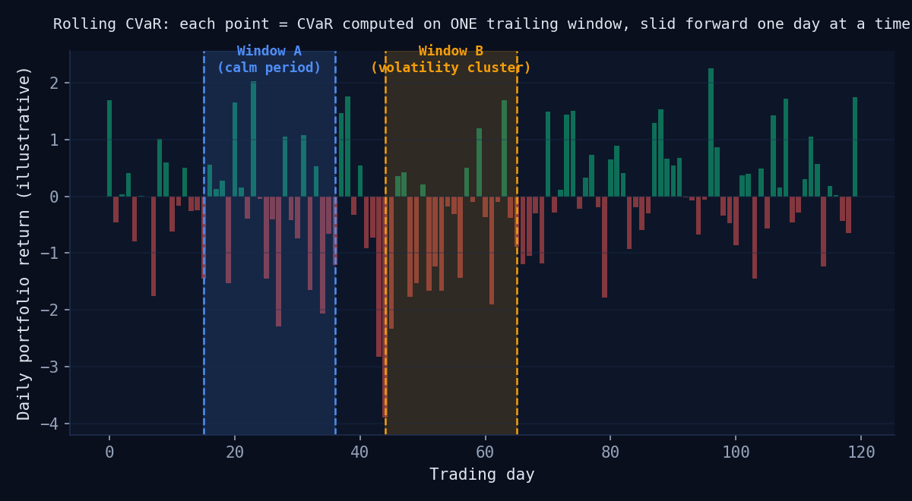

# Computations

This document explains **what** each risk and optimisation figure in Portfolio
Copilot measures, **how** it is computed, and — deliberately — **where the
method has edges**. It exists because several of the numbers in this app look
similar (they're all "CVaR 95%", "volatility", or "risk") but measure
genuinely different things, and conflating them is the single easiest mistake
to make when reading a portfolio risk dashboard.

Each section links to the source file that implements it. Nothing here is
aspirational — every formula below is the formula actually running in
`servers/`.

---

## Contents

1. [CVaR: the two-horizon distinction](#1-cvar-the-two-horizon-distinction)
2. [GARCH volatility forecasting](#2-garch-volatility-forecasting)
3. [Rolling risk evolution](#3-rolling-risk-evolution)
4. [Portfolio optimisation](#4-portfolio-optimisation)
5. [Compliance CVaR selection](#5-compliance-cvar-selection)
6. [Glossary](#6-glossary)

---

## 1. CVaR: the two-horizon distinction

The single most important thing to understand about this app's risk numbers:
**there are two different CVaR₉₅ figures, computed from two different
distributions, and they are not comparable without knowing which is which.**



### 1.1 What CVaR measures

CVaR (Conditional Value at Risk, a.k.a. Expected Shortfall) at the 95%
confidence level answers: *"if I'm in the worst 5% of outcomes, what's my
average loss in that tail?"* Mechanically, for any set of return
observations:

```
VaR_95   = -percentile(returns, 5)              # the tail threshold
CVaR_95  = -mean(returns[returns < -VaR_95])     # average loss beyond it
```

Both are expressed as positive-loss numbers. CVaR ≥ VaR always, because CVaR
averages *everything* worse than the VaR threshold, not just the threshold
itself.

This formula is identical everywhere it's used in this app
(`servers/risk_engine/tools/risk_metrics.py::_compute_var`,
`_compute_cvar`, and the analogous functions in
`servers/scenario_simulation/tools/monte_carlo.py`,
`garch_simulation.py`). **The formula is never the source of the
discrepancy — the input distribution is.**

### 1.2 Computation 1 — 1-day historical CVaR

**Source:** `servers/risk_engine/tools/risk_metrics.py`

The input is the portfolio's **daily return series** over the observed
history (~497 trading days from a 2-year window): one number per real day,
built as a weighted sum of each asset's daily log-return,
`r_portfolio,t = Σ wᵢ·rᵢ,t`. VaR/CVaR are then computed once, over this
one, fixed set of ~497 observations.

**What it answers:** *"On a bad day — the worst 5% of days in the observed
history — how much does the portfolio lose, on average?"*

**Key properties:**
- **Backward-looking and empirical** — no simulation, no model assumptions
  beyond "history is representative."
- **Path-independent** — the 497 daily returns are treated as an
  unordered set. Shuffling their order would not change the result. Only
  the *shape* of the distribution matters, not the *sequence* of days.
- **Horizon = 1 day**, by construction — every observation feeding the
  calculation is a single day's return.

This is the figure shown as **"CVaR 95% · Daily (historical)"** in the Risk
Metrics table and the Risk tab posture strip.

### 1.3 Computation 2 — 1-year forward-simulated CVaR

**Sources:** `servers/scenario_simulation/tools/monte_carlo.py`,
`servers/scenario_simulation/tools/garch_simulation.py`

The input here is not historical days at all — it's **thousands of
simulated 252-trading-day paths**, each generated from statistics estimated
off the historical data (mean, volatility; for GARCH, the fitted
persistence dynamics and Student-t innovations). Each path is compounded
into one **terminal value** — where the portfolio ends up after a
simulated year. CVaR is then computed over the resulting distribution of
N terminal outcomes.

```
terminal_value_i = Σ_t r_portfolio,i,t     # cumulative return, path i, over 252 days
VaR_95  = -percentile(terminal_values, 5)   # 5th pct of ANNUAL outcomes
CVaR_95 = -mean(terminals worse than -VaR)  # avg of worst 5% of simulated YEARS
```

**What it answers:** *"In a bad year — the worst 5% of simulated annual
outcomes — how much does the portfolio lose over the whole year, on
average?"*

**Key properties:**
- **Forward-looking and simulated** — genuinely stochastic paths, not a
  scaled version of the daily figure.
- **Path matters** — for the GARCH variant especially: today's simulated
  volatility depends on yesterday's simulated shock
  (`σ²_t = ω + α·ε²_{t-1} + β·σ²_{t-1}`), so sequence within a path is not
  discarded, unlike Computation 1.
- **Horizon = 252 trading days** (`orchestrator/nodes/simulate.py::_HORIZON_DAYS`),
  projected forward from the end of the historical data window — the
  standard trading-year convention, not a literal 365-calendar-day span.
- **Two variants exist:** Monte Carlo (static IID return distribution) and
  GARCH-conditional (evolving volatility, fat-tailed innovations). GARCH
  produces the higher, more conservative CVaR because it captures
  volatility clustering that a static IID draw cannot. When the two
  diverge materially, the app raises a **volatility regime warning**.

This is the figure shown as **"CVaR 95% · 1-year (GARCH-simulated)"** (or
Monte Carlo, depending on availability — see §5) on the Compliance tab.

### 1.4 Why they differ by ~10–15×

Both computations are correct; they measure different things. The rough
intuition for the gap:

- **Horizon scaling.** Daily risk compounds toward annual risk roughly on
  the order of √252 ≈ 15.9, before any other effect.
- **Compounding and path dependence.** The simulation lets bad days stack
  within a single path — a genuinely fatter left tail than any single
  day's distribution can show.
- **Fat-tailed innovations (GARCH only).** Student-t shocks plus evolving
  volatility further fatten the simulated tail versus a static daily
  distribution.

**The practical rule:** never compare these two numbers directly without
stating the horizon. A dashboard showing "CVaR 95%: 2.6%" next to "CVaR 95%
breach at 39%" looks like a contradiction unless both are labelled with
their horizon — which is why every CVaR figure in this app now carries an
explicit `· Daily (historical)` or `· 1-year (…-simulated)` qualifier.

---

## 2. GARCH volatility forecasting

**Source:** `servers/risk_engine/tools/garch_forecast.py`

### 2.1 The model

Each asset's volatility is fitted as a univariate **GARCH(1,1) with
Student-t innovations**:

```
σ²_t = ω + α·ε²_{t-1} + β·σ²_{t-1}
```

- `ω` — the constant (baseline) term in the *variance* recursion. Not a
  volatility level itself.
- `α` — how strongly yesterday's shock (`ε²_{t-1}`) feeds into today's
  variance ("ARCH" term).
- `β` — how strongly yesterday's variance persists into today's
  ("GARCH" term).
- **Persistence** = `α + β`. For the model to be covariance-stationary
  (have a well-defined long-run average), persistence must be strictly
  less than 1.

Given a stationary fit, the **long-run (unconditional) variance** is:

```
longrun_var = ω / (1 − α − β)
```

### 2.2 The forecast — deterministic, mean-reverting, per-asset

The 10-day-forward volatility forecast shown on the Risk tab is:

```
σ²_{T+h} = longrun_var + (α+β)^h · (σ²_T − longrun_var)
```

This is the **deterministic expected path** — where volatility heads on
average, given no new shocks — computed independently for each asset using
*that asset's own fitted α+β*. It is not a simulation (that's a separate
artifact — see §1.3); it's a closed-form projection.

### 2.3 Mean reversion is bidirectional

A common misreading: assuming the forecast should always *decay*. It
doesn't — it reverts toward the long-run level from *wherever the current
level is*, which can be above or below:



- If current vol is **below** long-run → the forecast **rises** toward it.
- If current vol is **above** long-run → the forecast **falls** toward it.
- The **rate** of reversion is set by `(α+β)^h` — high-persistence assets
  (α+β near 1) revert slowly; low-persistence assets snap back quickly.

A rising forecast curve is not a bug — it means that asset's current
volatility sits below its own historical average, and the model expects a
slow drift back up.

### 2.4 Non-stationarity — when persistence ≥ 1

If a fit produces `α + β ≥ 1`, the model is **integrated (IGARCH)** or
explosive — `longrun_var` is undefined (division by zero or negative), so
there is no level to revert to. This is detected
(`persistence_warning = alpha_plus_beta >= 1.0`) and handled by falling
back to a flat forecast at the current volatility level, which is the
correct behaviour in the boundary case (`ω ≈ 0` implies
`σ²_{T+h} ≈ σ²_T`, i.e. an IGARCH/EWMA-style flat forecast) — this is a
recognised, standard convention (it's what an exponentially-weighted
moving average implicitly assumes), not an ad hoc patch.

**Three genuine causes of high measured persistence, and the correct
response to each — this is a deliberate v-next scope, not implemented:**

| Cause | Symptom | Correct fix |
|---|---|---|
| **Genuinely integrated** volatility | α+β ≈ 1, ω ≈ 0 | Flat/EWMA-style forecast (current fallback is directionally correct) |
| **Structural break** in the window (e.g. a regime shift mid-history) | α+β biased upward by treating a level-shift as persistence | Break detection + re-fit on the post-break window, or Markov-switching GARCH |
| **Long memory** (slowly-decaying autocorrelation GARCH's geometric decay can't capture) | Persistence reads high but memory isn't truly infinite | FIGARCH — fractional differencing applied to the *variance* process |

Note that neither a higher-order GARCH(p,q) nor differencing the *return*
series addresses the stationarity boundary itself — GARCH(2,2) has its own
persistence sum and can be just as non-stationary; and the returns are
already a first difference of log-price, so re-differencing removes the
signal, not the variance unit root. The fixes above are the ones that
actually target the mechanism.

---

## 3. Rolling risk evolution

**Source:** `servers/risk_engine/tools/rolling_cvar.py`

### 3.1 Why a "per-day CVaR" doesn't exist

CVaR is a statistic over a *set* of returns — the mean of the worst 5% of
observations in that set. A single day has exactly one return; one number
has no tail, no percentile, nothing to average. **There is no such thing
as the CVaR of one day.** A rolling CVaR chart therefore cannot plot "CVaR
per day" — it has to plot "CVaR per *window* of days," indexed by the day
each window ends.

### 3.2 The rolling-window mechanism



For a chosen window length `W` (21 / 63 / 252 trading days — 1M / 3M / 1Y),
and portfolio return series of length `n`:

```
for t in range(W-1, n):
    window = portfolio_returns[t-W+1 : t+1]
    rolling_cvar[t] = CVaR_95(window)     # same formula as §1.2
    rolling_vol[t]  = std(window, ddof=1) * sqrt(252)
```

Each point is a genuine **1-day-horizon CVaR** (identical method to §1.2),
just re-estimated on a trailing slice of history rather than the full
window. The **window length controls estimation lookback, not the loss
horizon** — even at the "1Y" setting, each point is still a 1-day CVaR; a
year of data is simply used to estimate it more smoothly. This is a
common point of confusion (documented on the Risk tab itself:
*"Each point is a 1-day CVaR estimated from a trailing {window} — not the
1-year forward-simulated CVaR shown on the Compliance tab"*).

### 3.3 Window choice is a real trade-off

- **Shorter windows (1M/21-day)** — reactive; visibly spikes during
  volatility clusters, then decays. Best for *seeing* clusters.
- **Longer windows (1Y/252-day)** — smooth; averages clusters away,
  showing structural risk *posture* rather than short-term stress.

All three windows are precomputed server-side in a single call so the
frontend selector switches instantly with no re-fetch.

### 3.4 Current vs. optimal overlay

The same rolling calculation runs twice per analysis — once on the
portfolio's current weights (`orchestrator/nodes/compute_risk.py`), once on
the optimiser's suggested weights (`orchestrator/nodes/optimise.py`, only
when optimisation runs). Plotting both series together makes
diversification value visible directly: if the optimal line sits
measurably lower than the current line *during* a volatility cluster, that
is direct visual evidence that the optimizer's allocation would have
absorbed the same historical stress better.

### 3.5 Endpoint reconciliation

The rolling series' final point (trailing `W` days) will generally **not**
equal the reported full-window CVaR₉₅ from §1.2 (computed on the full
~497-day history) — they are, by construction, different windows. The app
draws the full-window figure as a dashed reference line for context rather
than forcing an artificial match.

---

## 4. Portfolio optimisation

**Source:** `servers/portfolio_optimiser/tools/optimise.py`

Standard **mean-variance optimisation** (Markowitz), solved via SLSQP
(`convex_qp` solver), subject to weights summing to 1 and (currently)
long-only constraints:

```
maximise   Sharpe = (E[r_p] - r_f) / σ_p
subject to Σwᵢ = 1,  wᵢ ≥ 0
```

The **efficient frontier** (50 points, `_N_FRONTIER_POINTS`) is traced by
solving the same problem across a range of target returns. The **Max
Sharpe** point is the frontier point maximising the Sharpe ratio directly —
the tangency portfolio against the risk-free rate.

**Known v1 scope limit** (stated in-app): the frontier is computed only
from the current portfolio's own symbols, not the full NSE universe — so
this is the efficient frontier *reachable from the current holdings*, not
a true unconstrained Capital Market Line. Widening the tradeable universe
is explicit future scope.

---

## 5. Compliance CVaR selection

**Source:** `orchestrator/nodes/check_compliance.py::_select_cvar`

The `CVAR_THRESHOLD` compliance rule needs one CVaR₉₅ value to check
against its limit (25% in the `retail_conservative` ruleset — a threshold
calibrated for **annual** risk). The value is selected by priority,
preferring the most forward-looking estimate available:

```
1. simulation_result.garch_sim.cvar_95    (best — GARCH-conditional, 1-year)
2. simulation_result.monte_carlo.cvar_95   (1-year, static distribution)
3. risk_metrics.cvar_95                    (fallback — 1-day historical)
```

**This fallback has a real consequence, not just a labelling one.** If
both simulations are unavailable, the compliance check falls back to
comparing the **1-day** historical CVaR against a threshold calibrated for
**annual** risk — a breach becomes far less likely to fire in that state,
because the two are on incompatible scales. The frontend labels which
source was actually used (`cvar_source`, threaded through
`ComplianceResult` → API → UI) precisely so this degradation is visible
rather than silent — see the Compliance tab, which states the source and
horizon explicitly next to the gating CVaR figure.

---

## 6. Glossary

| Term | Meaning |
|---|---|
| **VaR (Value at Risk)** | The loss threshold that the worst *p*% of outcomes exceed. |
| **CVaR (Conditional VaR / Expected Shortfall)** | The average loss *within* that worst *p*% tail — always ≥ VaR. |
| **Persistence (α+β)** | How slowly a GARCH-fitted asset's volatility reverts to its long-run average. Must be < 1 for stationarity. |
| **IGARCH** | The boundary case α+β = 1 — volatility is integrated; no long-run average exists. |
| **Terminal value** | A simulated path's cumulative return at the end of the horizon (e.g. after 252 days) — the unit CVaR/VaR are computed over in forward simulation. |
| **Rolling window** | A fixed-length slice of history that slides forward one day at a time, used to re-estimate a statistic (here, CVaR/vol) at each point in time. |
| **Sharpe ratio** | Risk-adjusted return: `(E[r] - r_f) / σ`. |
| **Efficient frontier** | The set of portfolios offering the maximum expected return for each level of risk. |

---

*This document describes computations as implemented in `v3-guardrails`.
Method changes should update this file in the same commit as the code —
see `CHANGELOG.md` for what shipped when.*